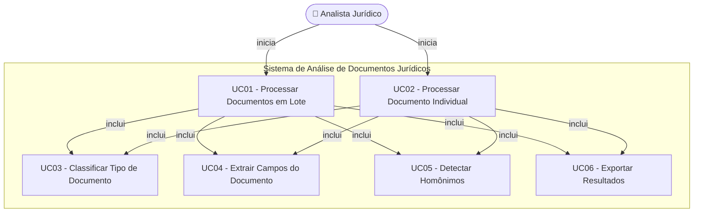

# Casos de Uso — Sistema de Análise de Documentos Jurídicos

## Visão Geral

O sistema automatiza a extração e classificação de dados em PDFs jurídicos (precatórios, certidões, CND). O diagrama abaixo representa os casos de uso identificados com base no processo atual.

---

## Diagrama de Casos de Uso

---

## Atores

| Ator | Tipo | Descrição |
|------|------|-----------|
| **Analista Jurídico** | Primário | Profissional responsável por executar o processo de análise dos documentos jurídicos e interpretar os resultados gerados. |
| **Sistema de Arquivos** | Secundário | Fonte dos arquivos PDF de entrada e destino dos resultados exportados (pasta `01_DATA_INPUT/` e `03_OUTPUT/`). |

---

## UC01 — Processar Documentos em Lote

| Campo | Descrição |
|-------|-----------|
| **Identificador** | UC01 |
| **Nome** | Processar Documentos em Lote |
| **Ator Principal** | Analista Jurídico |
| **Pré-condição** | A pasta de entrada (`01_DATA_INPUT/`) existe e contém ao menos um arquivo PDF. O ambiente Python com as dependências está configurado. |
| **Pós-condição** | Um arquivo Excel (`analise_consolidada.xlsx`) com os dados extraídos de todos os PDFs é salvo na pasta `03_OUTPUT/`. |
| **Trigger** | O analista executa o comando `python 02_SCRIPTS/extrator_principal.py`. |

### Fluxo Principal

1. O analista executa o script via linha de comando, informando opcionalmente a pasta de entrada, pasta de saída e parâmetros adicionais.
2. O sistema varre recursivamente a pasta de entrada e coleta todos os arquivos `.pdf` encontrados.
3. Para cada PDF encontrado, o sistema executa o caso de uso **UC02 — Processar Documento Individual**.
4. Ao finalizar todos os arquivos, o sistema executa o caso de uso **UC06 — Exportar Resultados**.
5. O sistema exibe no console o número de arquivos processados, linhas exportadas e tabelas extraídas.
6. O caso de uso encerra com sucesso.

### Fluxos Alternativos

| ID | Condição | Ação |
|----|----------|------|
| FA01 | O analista informa `--ocr` | O sistema ativa o OCR via Tesseract para páginas sem texto digital. |
| FA02 | O analista informa `--profile <tipo>` | O sistema utiliza o perfil de extração correspondente ao tipo de documento informado. |
| FA03 | O analista informa `--model <caminho.pkl>` | O sistema carrega um modelo scikit-learn serializado para auxiliar na classificação. |
| FA04 | O analista informa `--no-tables` | O sistema desativa a extração de tabelas estruturadas. |

### Fluxo de Exceção

| ID | Condição | Ação |
|----|----------|------|
| FE01 | A pasta de entrada não existe | O sistema exibe mensagem de erro e encerra sem processar. |
| FE02 | Nenhum PDF é encontrado na pasta | O sistema gera um arquivo de saída vazio e exibe aviso. |

---

## UC02 — Processar Documento Individual

| Campo | Descrição |
|-------|-----------|
| **Identificador** | UC02 |
| **Nome** | Processar Documento Individual |
| **Ator Principal** | Analista Jurídico |
| **Pré-condição** | O arquivo PDF existe e é legível. |
| **Pós-condição** | Os registros extraídos do PDF são adicionados ao resultado consolidado. |
| **Trigger** | Chamado por **UC01** para cada PDF encontrado, ou executado diretamente pelo analista via `--input <arquivo.pdf>`. |

### Fluxo Principal

1. O sistema abre o arquivo PDF com `pdfplumber`.
2. Para cada página do PDF:
   a. O sistema extrai o texto bruto da página.
   b. O sistema executa **UC03 — Classificar Tipo de Documento**.
   c. O sistema executa **UC04 — Extrair Campos do Documento**.
   d. O sistema executa **UC05 — Detectar Homônimos**.
   e. Se o status retornado for `"NADA CONSTAR"`, o sistema interrompe o processamento das páginas restantes deste arquivo (evita processar dezenas de páginas de homônimos).
   f. O sistema registra o resultado da página (tipo, risco, CPF, processo, data, valor, etc.) na lista de registros.
   g. O sistema extrai as tabelas estruturadas presentes na página.
3. O sistema retorna os registros e tabelas do PDF.

### Fluxo Alternativo

| ID | Condição | Ação |
|----|----------|------|
| FA01 | Falha ao abrir o PDF com `pdfplumber` | O sistema realiza fallback para o `HybridReader` (PyMuPDF ou OCR). |
| FA02 | A pasta-pai do PDF indica o tipo (`01_TJSP`, `03_CNDT`, etc.) | O sistema utiliza o tipo de pasta como dica de classificação, ignorando o classificador. |

### Fluxo de Exceção

| ID | Condição | Ação |
|----|----------|------|
| FE01 | O PDF está corrompido ou ilegível | O sistema registra o erro no console e pula o arquivo, continuando com os demais. |

---

## UC03 — Classificar Tipo de Documento

| Campo | Descrição |
|-------|-----------|
| **Identificador** | UC03 |
| **Nome** | Classificar Tipo de Documento |
| **Ator Principal** | Sistema (chamado internamente) |
| **Pré-condição** | O texto bruto da página foi extraído. |
| **Pós-condição** | O tipo do documento e seu nível de risco são identificados. |
| **Trigger** | Chamado por **UC02** para cada página processada. |

### Fluxo Principal

1. O sistema verifica se um modelo ML (`scikit-learn`) está carregado. Se sim, utiliza o modelo para predizer o tipo.
2. Se não houver modelo, o sistema analisa o texto com regras baseadas em palavras-chave:
   - `"Distribuições Criminais"` → `criminal_estadual`
   - `"Distribuições Cíveis"` → `civel_estadual`
   - `"Débitos Relativos a Tributos Federais"` → `cnd_federal`
   - `"Tribunal Regional Federal"` / `"TRF"` → `trf3`
   - `"Certidão Negativa de Débitos Trabalhistas"` / `"CNDT"` → `cndt`
   - `"CEAT"` / `"Certidão de Ações Trabalhistas"` → `ceat`
   - Outros federais cíveis → `civel_federal`
   - Outros federais criminais → `criminal_federal`
   - Eleitoral → `eleitoral`
   - Nenhuma correspondência → `desconhecido`
3. O sistema determina o nível de risco conforme a tabela:

| Tipo | Nível de Risco |
|------|----------------|
| `civel_estadual` | 🔴 Máximo |
| `cnd_federal` | 🔴 Máximo |
| `civel_federal` | 🔴 Máximo |
| `cnd_estadual` | 🔴 Máximo |
| `cndt` | 🟡 Médio |
| `criminal_estadual` | 🟡 Médio |
| `criminal_federal` | 🟡 Médio |
| `trf3` | 🟢 Informativo |
| `ceat` | 🟢 Informativo |
| `eleitoral` | 🟢 Informativo |
| `desconhecido` | 🟢 Informativo |

4. O sistema retorna o tipo identificado e o nível de risco.

---

## UC04 — Extrair Campos do Documento

| Campo | Descrição |
|-------|-----------|
| **Identificador** | UC04 |
| **Nome** | Extrair Campos do Documento |
| **Ator Principal** | Sistema (chamado internamente) |
| **Pré-condição** | O texto bruto da página e o tipo do documento foram identificados. |
| **Pós-condição** | Os campos estruturados do documento são extraídos e disponibilizados para registro. |
| **Trigger** | Chamado por **UC02** para cada página processada. |

### Fluxo Principal

1. O sistema seleciona o perfil de extração correspondente ao tipo de documento classificado (ex.: `civel_estadual`, `cndt`, `trf3`).
2. O sistema aplica expressões regulares (Regex) sobre o texto normalizado para extrair os campos:
   - **CPF** — padrão `XXX.XXX.XXX-XX`
   - **Número do Processo** — padrão CNJ `NNNNNNN-DD.YYYY.D.DD.YYYY`
   - **Data** — padrão `DD/MM/YYYY`
   - **Valor Monetário** — padrão `R$ X.XXX,XX`
   - **Nome** — capturado após palavras-chave como "Nome:", "Interessado:", "Requerente:"
   - **Tipo de Ação** — capturado após "Classe:" ou "Tipo de Ação:"
   - **Situação Processual** — capturado após "Situação:" ou "Fase:"
   - **Vara** — capturado após "Vara:"
   - **Foro/Comarca** — capturado após "Foro:" ou "Comarca:"
3. O sistema utiliza extração geométrica via coordenadas `pdfplumber` para identificar processos marcados com o caractere `»` na margem esquerda (padrão do TJSP).
4. O sistema retorna os campos extraídos como um objeto `ParsedFields`.

### Fluxo Alternativo

| ID | Condição | Ação |
|----|----------|------|
| FA01 | Um campo não é encontrado no texto | O sistema registra o campo como `None` (vazio) no resultado. |
| FA02 | O texto possui tabelas estruturadas | O sistema extrai as tabelas e as armazena separadamente na aba "tables" do Excel. |

---

## UC05 — Detectar Homônimos

| Campo | Descrição |
|-------|-----------|
| **Identificador** | UC05 |
| **Nome** | Detectar Homônimos |
| **Ator Principal** | Sistema (chamado internamente) |
| **Pré-condição** | O CPF-alvo do titular foi informado (opcional via `cpf_alvo`). |
| **Pós-condição** | O status da certidão para o CPF-alvo é determinado (`"NADA CONSTAR"` ou `"POSITIVA"`), evitando falsos positivos de homônimos. |
| **Trigger** | Chamado por **UC02** durante o processamento de cada página. |

### Fluxo Principal

1. Se nenhum CPF-alvo foi informado:
   a. O sistema verifica se o texto da página contém expressões de ausência de ocorrências (`"nada constar"`, `"sem ocorrências"`, `"não constam"` etc.).
   b. Se sim, retorna `"NADA CONSTAR"`; caso contrário, retorna `"POSITIVA"`.
2. Se um CPF-alvo foi informado:
   a. O sistema localiza o CPF-alvo no texto da página.
   b. Analisa os 500 caracteres seguintes ao CPF para verificar a presença de expressão de ausência.
   c. Se encontrada, retorna `"NADA CONSTAR"` — indica que o titular não possui processos nesta certidão.
   d. Caso contrário, retorna `"POSITIVA"`.
3. O status é propagado ao registro do documento.
4. Se o status for `"NADA CONSTAR"`, **UC02** interrompe o processamento das demais páginas do arquivo.

---

## UC06 — Exportar Resultados

| Campo | Descrição |
|-------|-----------|
| **Identificador** | UC06 |
| **Nome** | Exportar Resultados |
| **Ator Principal** | Sistema (chamado internamente após processamento) |
| **Pré-condição** | Ao menos um documento foi processado e há registros na lista de resultados. |
| **Pós-condição** | Um arquivo Excel (`.xlsx`) ou CSV é salvo na pasta de saída (`03_OUTPUT/`). |
| **Trigger** | Chamado por **UC01** ao final do processamento de todos os documentos. |

### Fluxo Principal

1. O sistema converte a lista de registros (`DocumentRecord`) em um `DataFrame` pandas.
2. O sistema converte a lista de tabelas (`TableRecord`) em um segundo `DataFrame`.
3. O sistema cria o diretório de saída, se não existir.
4. Se o caminho de saída tiver extensão `.xlsx` ou `.xls`:
   a. O sistema gera um arquivo Excel com duas abas:
      - **pages** — uma linha por página processada, com todos os campos extraídos.
      - **tables** — tabelas estruturadas extraídas dos documentos.
5. Se o caminho de saída tiver extensão `.csv`:
   a. O sistema exporta os registros de páginas para o arquivo CSV principal.
   b. Se houver tabelas, exporta-as para um segundo arquivo CSV (`_tables.csv`).
6. O sistema retorna o caminho do arquivo de saída gerado.

### Fluxo Alternativo

| ID | Condição | Ação |
|----|----------|------|
| FA01 | Não há registros para exportar | O sistema gera um arquivo de saída vazio (sem linhas de dados). |

---

## Estrutura do Resultado (Aba "pages")

| Campo | Descrição |
|-------|-----------|
| `source_file` | Caminho do PDF de origem |
| `page_number` | Número da página |
| `document_type` | Tipo de documento classificado |
| `nivel_risco` | Nível de risco (`maximo`, `medio`, `informativo`) |
| `name` | Nome do titular |
| `cpf` | CPF formatado |
| `process_number` | Número do processo |
| `date` | Data extraída |
| `value` | Valor monetário |
| `tipo_acao` | Tipo de ação judicial |
| `situacao_processual` | Situação processual |
| `vara` | Vara judiciária |
| `foro` | Foro / Comarca |
| `status` | `NADA CONSTAR` ou `POSITIVA` |
| `raw_text` | Texto bruto da página |
| `text_source` | Origem do texto (`plumber`, `fitz`, `ocr`) |
| `table_count` | Número de tabelas na página |
| `processes_geometric` | Processos extraídos por marcador geométrico `»` |
